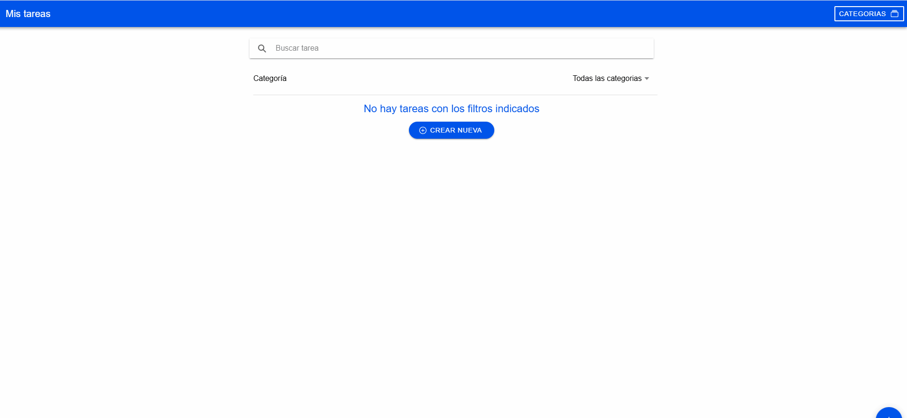
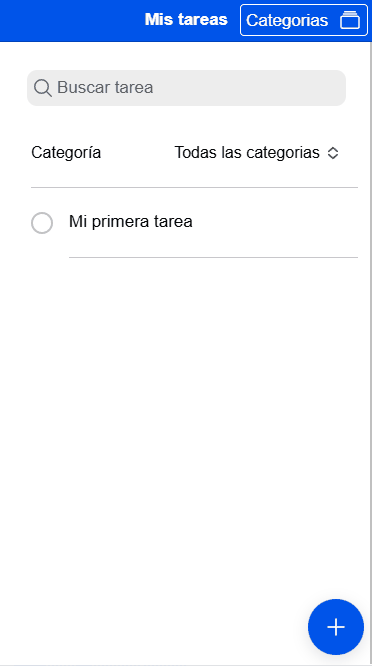
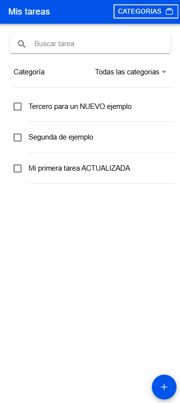
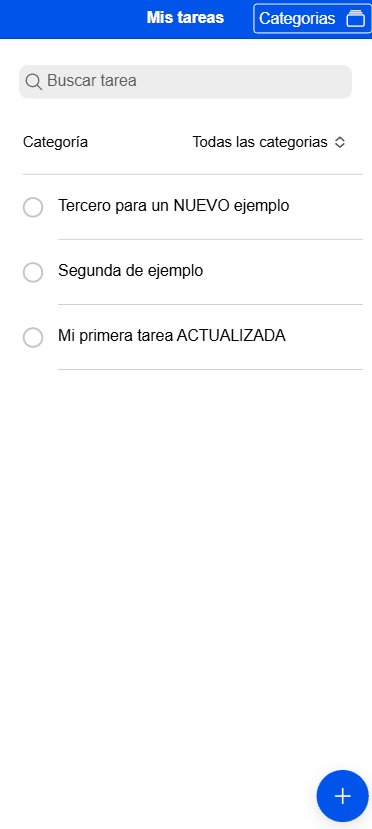
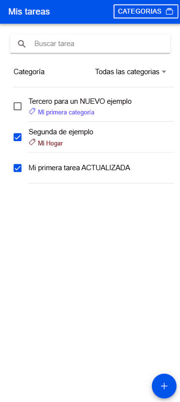
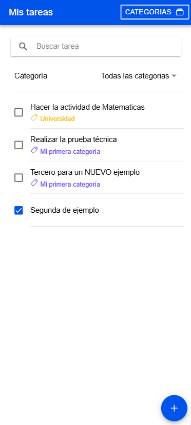
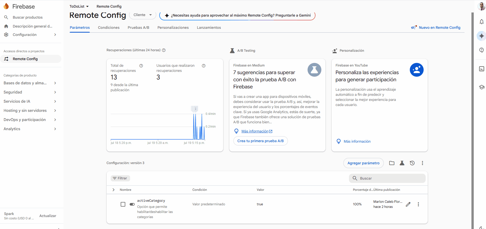

# ToDo List App
A continuacion voy a mostrar como la app funciona bajo los requerimientos indicados en la prueba tecnica, lo necesario para ejecutarlo y aspectos a tener presentes al momento de realizar las pruebas de funcionamiento.

### Versiones
Las versiones exactas que se usaron para desarrollar este aplicativo son las siguientes:

- Node Js v20.20.2
- NPM v10.8.2
- Angular v18.2.21
- Typescript v5.5.4
- zoneJs v0.14.10
- Cordova v12.0.0
- Java v17.0.18
- Ionic v7.2.1

En caso de ejecutarlas en desarrollo, tenerlas presentes.

### Cambios realizados

En este proyecto se crea el código fuente desde cero en la version de Angular 18, se integra tambien la herramienta Ionic 7 para así hacer la interfaz grafica con sus componentes que sirven para ejecutarse en apps nativas para IOS y Android.
Se usa una estructura simple para la organización del código en:

- **components**: Están todos los componentes que se reutilizan en diferentes páginas, tambien se encuentran los modals usados.
- **core**: Se encuentran otras herramientas como los guards y utilidades que se usan en las páginas.
- **models**: Están los modelos, clases e interfaces usadas para mapear toda la información.
- **pages**: Una de las partes fundamentales, se encuentran las vistas que ve el usuario y con las que interactua.
- **services**: Aquí se encuentra toda la lógica de negocio, metodos y funciones para crear, modificar, mostrar y eliminar tareas y categorias.

En la app, se usan dos rutas, */home* y */categories*. En *home* se pueden buscar tareas, filtrar por categoría, realizar acciónes CRUD y tambien marcar la tarea como completada a través de un checkbox. En *categories* encontramos todas las categorías donde tambien se pueden realizar acciónes CRUD. A la categoría se le puede colocar un color para identificarla mejor.

Tambien se implementó Firebase Remote Config para controlar una funcionalidad de la app que en este caso se administra las categorias, gracias a esto al momento de habilitarlo se pueden crear categorias y asignarlas a las tareas, si no lo está, no se permite lo anterior.

En el desarrollo se usaron bases modernas del sistema de reactividad que tiene Angular, como los Signals y Computed que nos permiten modificar la información y leerla sin necesidad de usar subscripciones. Estos se usan en los servicios para así tener consistencia en la información y que solamente haya un lugar donde están los datos y evitar que cada componente tenga que cargar los mismos datos cada vez que se crean. Tambien se usan la sintaxis moderna de control de flujo como @if, @for, @let que reemplazan a las directivas *ngIf y *ngFor.

En los estilos se usaron componentes nativos de Ionic para que así al momento de la app ejecutarse en cualquier entorno (Web, IOS y Android) mantenga un diseño limpio y ordenado.

## Videos e Imagenes de evidencia

- Crear una tarea.

- Editar tarea.

- Crear categoría.

- Asignar categoría a tarea y filtrar por ella.

- Eliminar categoría y tarea.

- Usar buscador en las tareas.

- App ejecutada en APK móvil.

- **Demostración** de Firebase Remote Config para habilitar/deshabilitar categorías.

## Ejecucion de proyecto y compilación
Para ejecutar y compilar este proyecto se debe hacer lo siguiente:

- Tener instalada las versiones anteriormente relacionadas.
- Ejecutar `npm i` y luego `ng serve --open`
- En caso de ejecutar en Android o IOS. ingresar `ng build` y luego `cordova run android` o `cordova run ios`

## Archivos y proyecto
En la carpeta *evidencias* se encuentra todos los videos de pruebas realizadas, tambien el archivo APK *todolist.apk* para que puedan instalarla en un equipo Android para realizar pruebas.

La version Web se encuentra publicada en el siguiente enlace: https://mallonflowerz.github.io/ToDoList/

Cualquier inconveniente o pregunta, pueden contactarme.

**Nota:** Como la app está desarrollada con Ionic y Cordova, que es multiplataforma. Ya se adjuntó el APK para Android. La creacion del IPA requiere de un entorno de desarrollo en macOS con Xcode para firmar y compilar el archivo. Lamentablemente no poseo esos recursos, pero aún así les dejo en los videos evidencia de como se vería la app en Iphone y el código fuente que en caso de ser compilado, funcionaria correctamente para ese entorno.

## Respuesta a interrogantes

1. **¿Cuáles fueron los principales desafíos que enfrentaste al implementar
las nuevas funcionalidades?**

Uno de ellos fue la configuración de todo el proyecto para que puediera compilar con Cordova para Android, ya que al usar versiones recientes de Angular, Typescript e Ionic, me estaba dando bastantes errores de compatibilidad. 

2. **¿Qué técnicas de optimización de rendimiento aplicaste y por qué?**

Decidí hacer uso en los servicios de las bases modernas de reactividad de Angular, estos me permitieron poder tener una sola instancia de datos, donde están almacenados las tareas y categorías, de esa manera cualquier componente que implementara el servicio, tiene acceso a la información y no tiene la necesidad de hacer la solicitud para cargarla. 

De esa manera ayuda a que haya una consistencia de datos y que si alguna información cambia, en los demás componentes se va a ver esa actualización, tambien ayuda a que no haya redundacia de solicitudes cargando siempre la misma información.

Otra ventaja que permite *computed* me ayudó a crear una "copia" de los datos originales para así mostrar las tareas por filtro de busqueda y categoría, así no tengo que afectar los datos reales ni tampoco estar haciendo solicitudes cada vez que quiera filtrar para buscar la información dentro del storage.

3. **¿Cómo aseguraste la calidad y mantenibilidad del código?**

Desde el comienzo empecé a hacer uso de buenas practicas de programación, como la correcta organización de las fuentes, asignar responsabilidades para no sobrecargar metodos o funciones, usar operadores ternarios, para simplificar condiciones y de propagación para crear nuevos arreglos copiando lo anterior. 

### ¡Muchas gracias!
